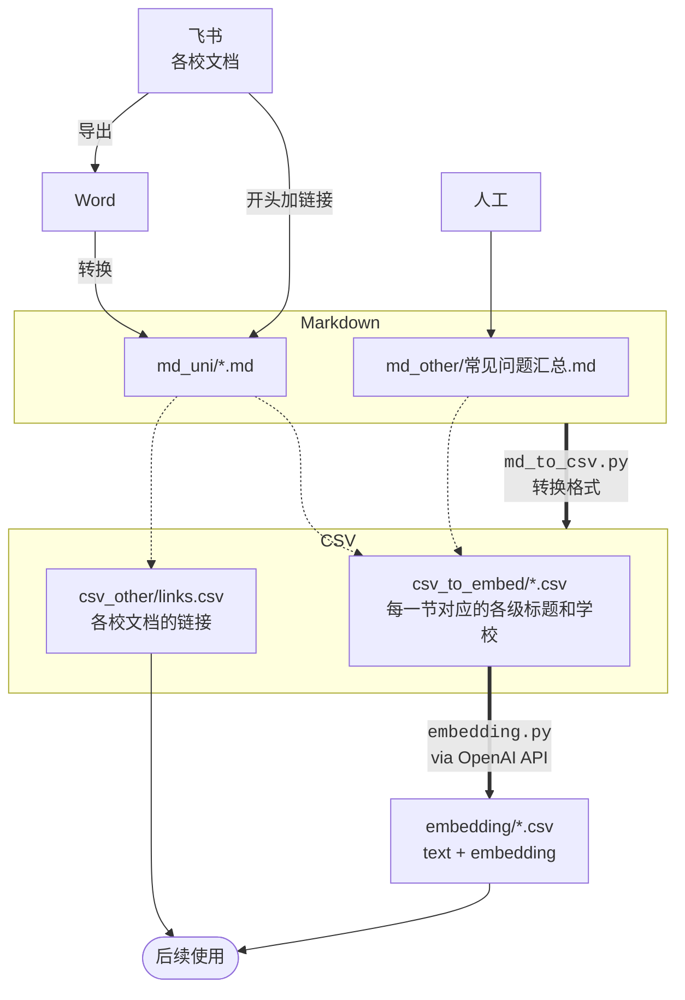
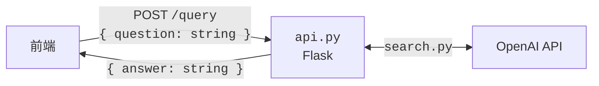

# Scholar Compass' Backend

## 流程

### 准备数据

另外，用`read_csv.py`可检视生成的`embedding/*.csv`。

### 后端

`search.py`从 OpenAI 生成答案步骤如下。

1. `ask()`

   > [!WARNING]
   >
   > `ask()`的`history`参数似乎实际未使用。

   1. `query_message()`
      1. `strings_ranked_by_relatedness()`根据输入的问题，利用`openai.Embedding`选出相关学校。
      2. 在问题之前补充“大学信息”等提示。

   2. 向`openai.ChatCompletion`提问并返回答案。

   > [!WARNING]
   >
   > [`983d474`](https://github.com/Scholar-Compass/Scholar-Compass-backend/commit/983d4747810aa3e0b64295499f6c9df4622b494b)给每次提问强行加了“MUST ANSWER IN ENGLISH”，恐怕需要回退。

2. `add_link()`

   用`csv_other/links.csv`匹配校名，添加相应链接。
